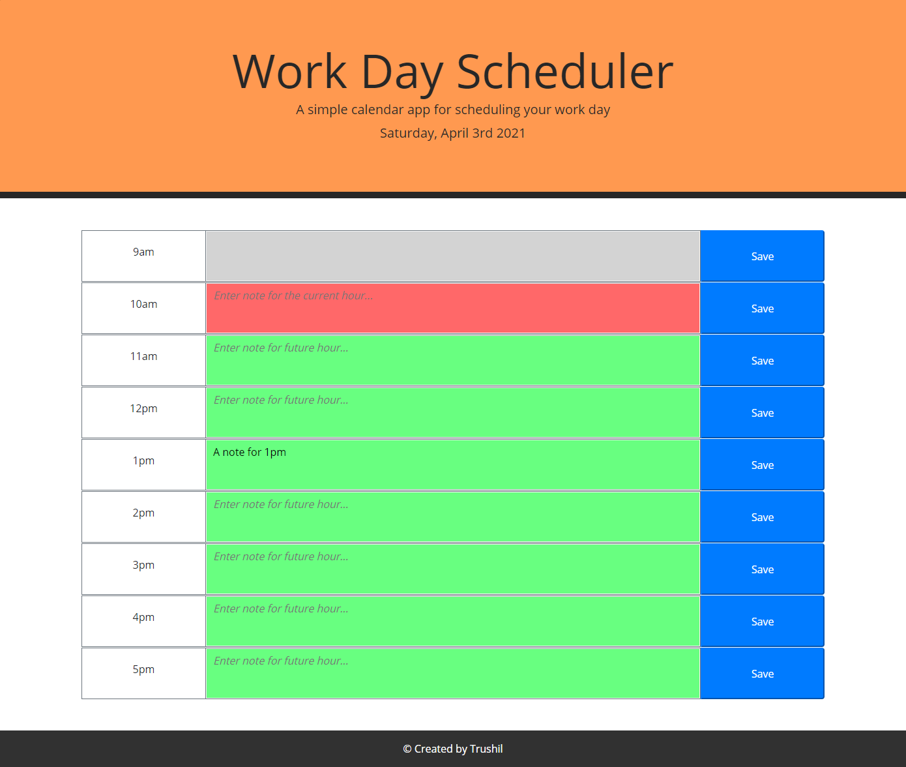

# Work Day Scheduler

## 📖Table of Contents
1. [Description](#description)
2. [Link](#Link)
3. [Screenshots](#Screenshots)
4. [Technologies](#Technologies)
5. [Contributing](#Contributing)
6. [Author](#Author)
7. [License](#License)

## Description

A simple calendar application that allows a user to save events for each hour of the working day.

Clicking the Save button or pressing "Enter" key can save the text inputted as a note for the hour.

## Link

The link to the deployed application:

Work Day Scheduler: https://trushilbudhia.github.io/Work-Day-Scheduler/

## Screenshots

The following images show the web application's appearance anf functionality:

> **Note**: This layout is responsive.

## Technologies
- JavaScript
- jQuery
- HTML
- CSS

## Contributing
Contributions, issues and feature requests are welcome.

Feel free to check [issues page](https://github.com/TrushilBudhia/Work-Day-Scheduler/issues) if you want to contribute.

## Author
👤Trushil Budhia
- Github: [@Trushil](https://github.com/TrushilBudhia)
- Email: trushil.budhia@gmail.com

## License
Copyright © 2021 [Trushil](https://github.com/TrushilBudhia)

This project is [MIT](./LICENSE.md) licensed